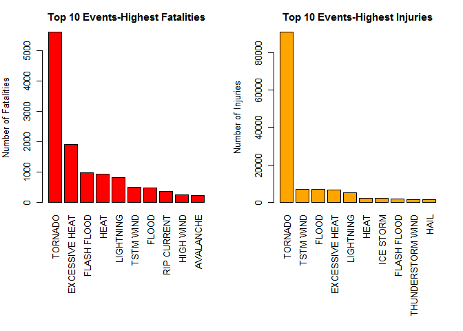
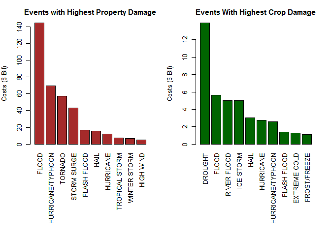

Impact of Sever Weather on Public Health and Econmics
================
Craig Tedeton
06/04/2016

1.  Synopsis

The goal of this research is to explore the NOAA Storm Database and potenetial impact of severe weather events on both the population and economy.

The database covers the time period from between 1950 and November 2012. In the earlier years of the database there are generally fewer events recorded, most likely due to a lack of good records. More recent years should be considered more complete.

The analysis aims to investigate which different types of sever weather events are most harmful on the populations health in respect of general injuries and fatalities. Further the economic consequences will be analyzed by exploring the financial damage done to both general property and agriculture (i.e. crops)

1.  Data Processing The data being processed was gathered from the NOAA Storm Database. It was accessed and processed utilizing the following code:

``` r
# Data Processing
fileUrl <- "https://d396qusza40orc.cloudfront.net/repdata%2Fdata%2FStormData.csv.bz2"
download.file(fileUrl, "./data/StormData.csv.bz2")
fpath <- file.path("./data")
filelist <- list.files(fpath, recursive = TRUE)
filelist
```

    ## [1] "StormData.csv.bz2"

``` r
fileName <- "./data/StormData.csv.bz2"

stormData <- read.csv(fileName)
summary(stormData)
```

    ##     STATE__                  BGN_DATE             BGN_TIME     
    ##  Min.   : 1.0   5/25/2011 0:00:00:  1202   12:00:00 AM: 10163  
    ##  1st Qu.:19.0   4/27/2011 0:00:00:  1193   06:00:00 PM:  7350  
    ##  Median :30.0   6/9/2011 0:00:00 :  1030   04:00:00 PM:  7261  
    ##  Mean   :31.2   5/30/2004 0:00:00:  1016   05:00:00 PM:  6891  
    ##  3rd Qu.:45.0   4/4/2011 0:00:00 :  1009   12:00:00 PM:  6703  
    ##  Max.   :95.0   4/2/2006 0:00:00 :   981   03:00:00 PM:  6700  
    ##                 (Other)          :895866   (Other)    :857229  
    ##    TIME_ZONE          COUNTY           COUNTYNAME         STATE       
    ##  CST    :547493   Min.   :  0.0   JEFFERSON :  7840   TX     : 83728  
    ##  EST    :245558   1st Qu.: 31.0   WASHINGTON:  7603   KS     : 53440  
    ##  MST    : 68390   Median : 75.0   JACKSON   :  6660   OK     : 46802  
    ##  PST    : 28302   Mean   :100.6   FRANKLIN  :  6256   MO     : 35648  
    ##  AST    :  6360   3rd Qu.:131.0   LINCOLN   :  5937   IA     : 31069  
    ##  HST    :  2563   Max.   :873.0   MADISON   :  5632   NE     : 30271  
    ##  (Other):  3631                   (Other)   :862369   (Other):621339  
    ##                EVTYPE         BGN_RANGE           BGN_AZI      
    ##  HAIL             :288661   Min.   :   0.000          :547332  
    ##  TSTM WIND        :219940   1st Qu.:   0.000   N      : 86752  
    ##  THUNDERSTORM WIND: 82563   Median :   0.000   W      : 38446  
    ##  TORNADO          : 60652   Mean   :   1.484   S      : 37558  
    ##  FLASH FLOOD      : 54277   3rd Qu.:   1.000   E      : 33178  
    ##  FLOOD            : 25326   Max.   :3749.000   NW     : 24041  
    ##  (Other)          :170878                      (Other):134990  
    ##          BGN_LOCATI                  END_DATE             END_TIME     
    ##               :287743                    :243411              :238978  
    ##  COUNTYWIDE   : 19680   4/27/2011 0:00:00:  1214   06:00:00 PM:  9802  
    ##  Countywide   :   993   5/25/2011 0:00:00:  1196   05:00:00 PM:  8314  
    ##  SPRINGFIELD  :   843   6/9/2011 0:00:00 :  1021   04:00:00 PM:  8104  
    ##  SOUTH PORTION:   810   4/4/2011 0:00:00 :  1007   12:00:00 PM:  7483  
    ##  NORTH PORTION:   784   5/30/2004 0:00:00:   998   11:59:00 PM:  7184  
    ##  (Other)      :591444   (Other)          :653450   (Other)    :622432  
    ##    COUNTY_END COUNTYENDN       END_RANGE           END_AZI      
    ##  Min.   :0    Mode:logical   Min.   :  0.0000          :724837  
    ##  1st Qu.:0    NA's:902297    1st Qu.:  0.0000   N      : 28082  
    ##  Median :0                   Median :  0.0000   S      : 22510  
    ##  Mean   :0                   Mean   :  0.9862   W      : 20119  
    ##  3rd Qu.:0                   3rd Qu.:  0.0000   E      : 20047  
    ##  Max.   :0                   Max.   :925.0000   NE     : 14606  
    ##                                                 (Other): 72096  
    ##            END_LOCATI         LENGTH              WIDTH         
    ##                 :499225   Min.   :   0.0000   Min.   :   0.000  
    ##  COUNTYWIDE     : 19731   1st Qu.:   0.0000   1st Qu.:   0.000  
    ##  SOUTH PORTION  :   833   Median :   0.0000   Median :   0.000  
    ##  NORTH PORTION  :   780   Mean   :   0.2301   Mean   :   7.503  
    ##  CENTRAL PORTION:   617   3rd Qu.:   0.0000   3rd Qu.:   0.000  
    ##  SPRINGFIELD    :   575   Max.   :2315.0000   Max.   :4400.000  
    ##  (Other)        :380536                                         
    ##        F               MAG            FATALITIES          INJURIES        
    ##  Min.   :0.0      Min.   :    0.0   Min.   :  0.0000   Min.   :   0.0000  
    ##  1st Qu.:0.0      1st Qu.:    0.0   1st Qu.:  0.0000   1st Qu.:   0.0000  
    ##  Median :1.0      Median :   50.0   Median :  0.0000   Median :   0.0000  
    ##  Mean   :0.9      Mean   :   46.9   Mean   :  0.0168   Mean   :   0.1557  
    ##  3rd Qu.:1.0      3rd Qu.:   75.0   3rd Qu.:  0.0000   3rd Qu.:   0.0000  
    ##  Max.   :5.0      Max.   :22000.0   Max.   :583.0000   Max.   :1700.0000  
    ##  NA's   :843563                                                           
    ##     PROPDMG          PROPDMGEXP        CROPDMG          CROPDMGEXP    
    ##  Min.   :   0.00          :465934   Min.   :  0.000          :618413  
    ##  1st Qu.:   0.00   K      :424665   1st Qu.:  0.000   K      :281832  
    ##  Median :   0.00   M      : 11330   Median :  0.000   M      :  1994  
    ##  Mean   :  12.06   0      :   216   Mean   :  1.527   k      :    21  
    ##  3rd Qu.:   0.50   B      :    40   3rd Qu.:  0.000   0      :    19  
    ##  Max.   :5000.00   5      :    28   Max.   :990.000   B      :     9  
    ##                    (Other):    84                     (Other):     9  
    ##       WFO                                       STATEOFFIC    
    ##         :142069                                      :248769  
    ##  OUN    : 17393   TEXAS, North                       : 12193  
    ##  JAN    : 13889   ARKANSAS, Central and North Central: 11738  
    ##  LWX    : 13174   IOWA, Central                      : 11345  
    ##  PHI    : 12551   KANSAS, Southwest                  : 11212  
    ##  TSA    : 12483   GEORGIA, North and Central         : 11120  
    ##  (Other):690738   (Other)                            :595920  
    ##                                                                                                                                                                                                     ZONENAMES     
    ##                                                                                                                                                                                                          :594029  
    ##                                                                                                                                                                                                          :205988  
    ##  GREATER RENO / CARSON CITY / M - GREATER RENO / CARSON CITY / M                                                                                                                                         :   639  
    ##  GREATER LAKE TAHOE AREA - GREATER LAKE TAHOE AREA                                                                                                                                                       :   592  
    ##  JEFFERSON - JEFFERSON                                                                                                                                                                                   :   303  
    ##  MADISON - MADISON                                                                                                                                                                                       :   302  
    ##  (Other)                                                                                                                                                                                                 :100444  
    ##     LATITUDE      LONGITUDE        LATITUDE_E     LONGITUDE_    
    ##  Min.   :   0   Min.   :-14451   Min.   :   0   Min.   :-14455  
    ##  1st Qu.:2802   1st Qu.:  7247   1st Qu.:   0   1st Qu.:     0  
    ##  Median :3540   Median :  8707   Median :   0   Median :     0  
    ##  Mean   :2875   Mean   :  6940   Mean   :1452   Mean   :  3509  
    ##  3rd Qu.:4019   3rd Qu.:  9605   3rd Qu.:3549   3rd Qu.:  8735  
    ##  Max.   :9706   Max.   : 17124   Max.   :9706   Max.   :106220  
    ##  NA's   :47                      NA's   :40                     
    ##                                            REMARKS           REFNUM      
    ##                                                :287433   Min.   :     1  
    ##                                                : 24013   1st Qu.:225575  
    ##  Trees down.\n                                 :  1110   Median :451149  
    ##  Several trees were blown down.\n              :   568   Mean   :451149  
    ##  Trees were downed.\n                          :   446   3rd Qu.:676723  
    ##  Large trees and power lines were blown down.\n:   432   Max.   :902297  
    ##  (Other)                                       :588295

``` r
rows <- nrow(stormData) ; cols <- ncol(stormData)
rows ; cols
```

    ## [1] 902297

    ## [1] 37

2.1 Subset of Data We will be looking specifically at a subset of this data. So, we need to extract the columns for property damage, injuries and fatalities

``` r
eventData <- c("EVTYPE", "FATALITIES", "INJURIES", "PROPDMG", "PROPDMGEXP", "CROPDMG", "CROPDMGEXP")
myData <- stormData[eventData]
```

2.1.1 Finding Property Damage The data also requires we find unique information on property damage, thus we will not look at the injuries and fatalities as of yet. Invalid data was excluded by assigning a value of zero (‘0’). Then property damage value was calculated by multiplying the property damage and property exponent.

``` r
unique(myData$PROPDMGEXP)
```

    ##  [1] K M   B m + 0 5 6 ? 4 2 3 h 7 H - 1 8
    ## Levels:  - ? + 0 1 2 3 4 5 6 7 8 B h H K m M

``` r
# assign value to property exponent
myData$PROPEXP[myData$PROPDMGEXP == "K"] <- 1000
myData$PROPEXP[myData$PROPDMGEXP == "M"] <- 1e+06
myData$PROPEXP[myData$PROPDMGEXP == ""] <- 1
myData$PROPEXP[myData$PROPDMGEXP == "B"] <- 1e+09
myData$PROPEXP[myData$PROPDMGEXP == "m"] <- 1e+06
myData$PROPEXP[myData$PROPDMGEXP == "0"] <- 1
myData$PROPEXP[myData$PROPDMGEXP == "5"] <- 1e+05
myData$PROPEXP[myData$PROPDMGEXP == "6"] <- 1e+06
myData$PROPEXP[myData$PROPDMGEXP == "4"] <- 10000
myData$PROPEXP[myData$PROPDMGEXP == "2"] <- 100
myData$PROPEXP[myData$PROPDMGEXP == "3"] <- 1000
myData$PROPEXP[myData$PROPDMGEXP == "h"] <- 100
myData$PROPEXP[myData$PROPDMGEXP == "7"] <- 1e+07
myData$PROPEXP[myData$PROPDMGEXP == "H"] <- 100
myData$PROPEXP[myData$PROPDMGEXP == "1"] <- 10
myData$PROPEXP[myData$PROPDMGEXP == "8"] <- 1e+08

# handling invalid data
myData$PROPEXP[myData$PROPDMGEXP == "+"] <- 0
myData$PROPEXP[myData$PROPDMGEXP == "-"] <- 0
myData$PROPEXP[myData$PROPDMGEXP == "?"] <- 0

# calculate property damage
myData$PROPDMGVAL <- myData$PROPDMG * myData$PROPEXP
```

2.1.2 Finding Crop Damages Crop damage exponent by level were listed and assigned for the crop exponent data. Invalid data was excluded by assigning the value of zero (‘0’). Then crop damage value was calculated by multiplying the crop damage and crop exponent.

    ## [1]   M K m B ? 0 k 2
    ## Levels:  ? 0 2 B k K m M

2.2 Calculating the Costs of the Events

Observations note that the " most harmful to population health" events are fatalities and injuries. So those are the only ones selected.

Observations note that the " most harmful to economic problem“” events are property and crop damage. So those events are the only selected.

For each incident (fatalities, Injuries, property and crop damage), the total values were estimated.

We also need to aggregate to values for the events

``` r
# totals by events
fatality <- aggregate(FATALITIES ~ EVTYPE, myData, FUN = sum)
injury <- aggregate(INJURIES ~ EVTYPE, myData, FUN = sum)
propDamag <- aggregate(PROPDMGVAL ~ EVTYPE, myData, FUN = sum)
cropDamag <- aggregate(CROPDMGVAL ~ EVTYPE, myData, FUN = sum)
```

2.3 Reviewing Highest Fatalities and Injuries

2.3.1 Top 10 Highest Fatalities and Injuries

Plotting the top 10 highest fatalities and injuries will help better your understanding of the impact of these observations.

``` r
# highest fatalities
fatalsTop10 <- fatality[order(-fatality$FATALITIES), ][1:10, ]

# highest injuries
injuryTop10 <- injury[order(-injury$INJURIES), ][1:10, ]

# plots of Top 10s
par(mfrow = c(1, 2), mar = c(12, 4, 3, 2), mgp = c(3, 1, 0), cex = 0.8)

barplot(fatalsTop10$FATALITIES, las = 3, names.arg = fatalsTop10$EVTYPE, main = "Top 10 Events-Highest Fatalities", 
        ylab = "Number of Fatalities", col = "red")

barplot(injuryTop10$INJURIES, las = 3, names.arg = injuryTop10$EVTYPE, main = "Top 10 Events-Highest Injuries", 
        ylab = "Number of Injuries", col = "orange")
```



2.3.2 Top 10 Highest Property and Crop Damages

Plotting the top 10 highest fatalities and injuries will help better your understanding of the impact of these observations.

``` r
# highest property damage
propDamag10 <- propDamag[order(-propDamag$PROPDMGVAL), ][1:10, ]

# highest crop damage
cropDamag10 <- cropDamag[order(-cropDamag$CROPDMGVAL), ][1:10, ]

par(mfrow = c(1, 2), mar = c(12, 4, 3, 2), mgp = c(3, 1, 0), cex = 0.8)

barplot(propDamag10$PROPDMGVAL/(10^9), las = 3, names.arg = propDamag10$EVTYPE, main = "Events with Highest Property Damage", 
        ylab = "Costs ($ Bil)", col = "brown")

barplot(cropDamag10$CROPDMGVAL/(10^9), las = 3, names.arg = cropDamag10$EVTYPE, main = "Events With Highest Crop Damage", 
        ylab = "Costs ($ Bil)", col = "darkgreen")
```

 <br> 3. Results of the Research

After review of the data observations and the plotting of this information, we may conclude that; Their is a correlation with the highest number of fatalities and injuries with the TORNADO event. Also, excessive heat was noteworthy for high fatalities, while thunderstorm wind appears to contribute to injuries.

Their is also an apparent correlation between floods and maximum property damage. While drought caused maximum crop damage with flood also being highly noted.
